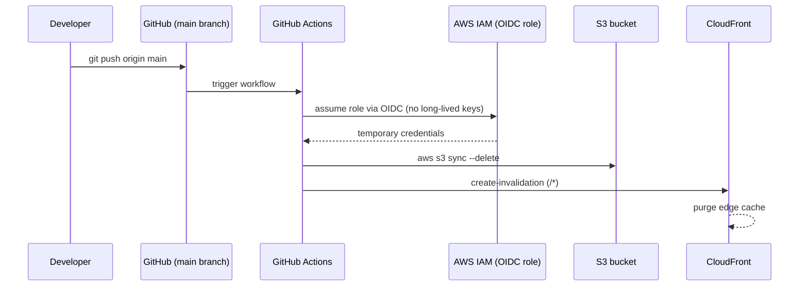
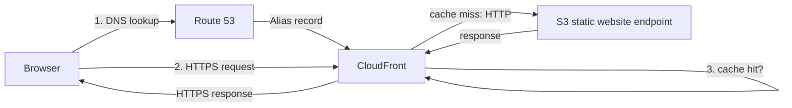

# Architecture

Static portfolio site (vanilla HTML/CSS/JS) deployed to AWS with a GitOps-style CI/CD pipeline.

## Overview

| Layer | Service | Purpose |
|---|---|---|
| Source control | GitHub | Single source of truth for site code |
| CI/CD | GitHub Actions (OIDC) | Builds nothing (static site), syncs files to S3 on every push to `main` |
| Storage / origin | Amazon S3 (static website hosting) | Serves the actual files |
| CDN / edge | Amazon CloudFront | HTTPS, caching, global edge delivery |
| DNS | Amazon Route 53 | Custom domain → CloudFront |

## Deploy flow (on `git push`)



## Request flow (when a visitor loads the site)



## Why this shape

- **GitHub Actions uses OIDC, not access keys.** The workflow assumes an IAM role scoped to `repo:owner/repo:ref:refs/heads/main`, so no AWS credentials are stored in GitHub Secrets.
- **CloudFront terminates TLS, not S3.** S3 website endpoints are HTTP-only by design; CloudFront sits in front to provide HTTPS (via a free `*.cloudfront.net` cert, or an ACM cert for a custom domain).
- **Route 53 is DNS only, not part of the deploy path.** It resolves the custom domain to CloudFront once, and doesn't run on every deploy.
- **Cache invalidation is explicit.** Without it, CloudFront would keep serving stale files from edge caches after a deploy.

## Cost

| Item | Cost |
|---|---|
| S3 storage/requests | ~$0 (a few MB of static files) |
| GitHub Actions | Free (public repo) |
| CloudFront (Free plan) | $0/month up to 1TB transfer / 10M requests |
| Route 53 hosted zone | $0 when attached to a CloudFront Free plan distribution |
| Custom domain registration | ~$12–20/year depending on TLD (the only unavoidable cost) |

## Repo structure

```
.
├── index.html
├── css/
│   └── style.css
├── src/                  # vanilla JS modules (i18n, project filter, active-menu, etc.)
├── i18n/                 # en/ja/ko translation dictionaries
├── images/
└── .github/workflows/
    └── deploy.yml        # GitHub Actions → S3 sync + CloudFront invalidation
```
