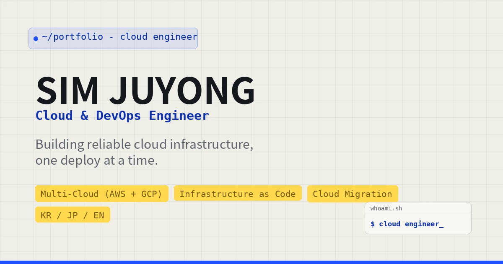

<div align="center">

# ☁️ SIM JUYONG | Cloud Engineer Portfolio

**From Code to Cloud — Building End-to-End Systems.**

A Cloud Engineer / DevOps portfolio built on a frontend development background, extended through hands-on
experience with public-sector system operations and financial-industry cloud migration in Japan.

[](http://sim-juyong-portfolio-s3.s3-website.ap-northeast-2.amazonaws.com/)
[](./ARCHITECTURE.md)


-2088FF?style=flat-square&logo=githubactions&logoColor=white>)

</div>

<br />

<p align="center">
  
</p>

<br />

## 📌 About

- **Target role**: Cloud Engineer / DevOps / SRE
- **Cloud**: Multi-cloud experience across AWS and GCP (5 AWS certifications)
- **Domain**: Financial-industry cloud migration, public-sector system operations
- **Strength**: Migration design, operational automation, technical documentation
- **Languages**: Korean · English · Japanese (working proficiency in cross-border projects)

This repository contains the static web portfolio showcasing the career above, along with the
**infrastructure and CI/CD setup that actually deploys and runs it on AWS**.
The design concept, "Engineer's Notebook," reinterprets a real engineer's working notes through a grid
background, navy/cobalt tones, and a terminal-style hero card.

## ✨ Highlights

|                                   |                                                                                                                           |
| --------------------------------- | ------------------------------------------------------------------------------------------------------------------------- |
| 🔄 **Cloud migration experience** | Documented the transition from JP1-based batch execution to container-based batch on GCP Cloud Run Jobs as a real project |
| ☁️ **Production AWS deployment**  | This portfolio itself is served via S3 + CloudFront + Route 53, with zero-touch deploys via GitHub Actions (OIDC)         |
| 🏆 **5 AWS certifications**       | Solutions Architect / Developer / CloudOps Engineer (Associate) + AI Practitioner + Cloud Practitioner                    |
| 🌐 **Trilingual site**            | A custom JSON-based i18n system switches between Korean / English / 日本語                                                |
| 🛠 **Hands-on operations**        | Real-world incident investigation, log analysis, and batch execution verification using Oracle/SQL                        |

## 🗂️ Site Sections

| Section        | Description                                                                                      |
| -------------- | ------------------------------------------------------------------------------------------------ |
| `Home`         | Typing-animation hero with key stats (target role / cloud / domain / strength)                   |
| `About`        | Career positioning and direction                                                                 |
| `Career`       | Timeline covering JCB cloud migration, public-sector system operations, and frontend development |
| `Skills`       | Skill map across 5 axes — Cloud / DevOps & IaC / Operation / Development / Tools                 |
| `Certificates` | 5 AWS certifications (linked to Credly badges)                                                   |
| `Projects`     | Cloud-focused project cards, each with an attached architecture diagram                          |
| `Contact`      | Email / GitHub / LinkedIn                                                                        |

## 🛠️ Tech Stack

**Frontend**

- Vanilla HTML5 / CSS3 (single stylesheet, design system built on custom properties)
- Vanilla JavaScript (ES Modules) — native browser module structure, no build tooling
- [TypeIt.js](https://typeitjs.com/) — hero typing animation
- Custom i18n module (`src/i18n.js`) — renders translations via `data-i18n` attributes

**Infrastructure / CI-CD**

- Amazon S3 — static website hosting (origin)
- Amazon CloudFront — HTTPS, caching, global edge delivery
- Amazon Route 53 — DNS for the custom domain
- GitHub Actions — assumes an AWS role via OIDC on every push to `main`, with no long-lived access keys

> For the full architecture — deploy-flow and request-flow sequence diagrams, and the cost breakdown — see **[📐 ARCHITECTURE.md](./ARCHITECTURE.md)**.

## 📁 Project Structure

```
.
├── index.html                 # Home → About → Career → Skills → Certificates → Projects → Contact
├── css/
│   └── style.css              # all styles (single file)
├── src/
│   ├── main.js                # entry point
│   ├── i18n.js                 # i18n handling
│   ├── projects.js             # project filtering
│   └── features/
│       ├── header.js          # header / scroll behavior
│       └── scroll_fade.js     # scroll interactions
├── i18n/                       # en.json / ja.json / ko.json
├── images/
│   ├── badges/                # AWS certification badges
│   └── architectures/         # per-project architecture diagrams (SVG)
├── .github/workflows/
│   └── deploy.yml             # GitHub Actions → S3 sync + CloudFront invalidation
└── ARCHITECTURE.md
```

## 🚀 Local Preview

```bash
python3 -m http.server 8000
```

Open http://localhost:8000 in your browser. No build step or dependency installation required.

## ☁️ Deploy to Amazon S3 (Static Website Hosting)

1. Create an S3 bucket.
2. Upload all files, preserving the folder structure (`css/`, `src/`, `i18n/`, `images/`, `index.html`).
3. Bucket → **Properties** → enable **Static website hosting**, set `index.html` as the index document.
4. Bucket → **Permissions** → uncheck "Block all public access" and add a bucket policy allowing `s3:GetObject` to `*` (or put CloudFront in front for HTTPS + a custom domain).
5. Open the static website endpoint URL to verify.

This repository automates the steps above via [`.github/workflows/deploy.yml`](./.github/workflows/deploy.yml): every push to `main` authenticates through OIDC, syncs to S3, and invalidates the CloudFront cache.

## 📫 Contact

- **Email**: [jysim1212@gmail.com](mailto:jysim1212@gmail.com)
- **GitHub**: [@moondolph](https://github.com/moondolph)
- **LinkedIn**: [juyong-sim-profile](https://www.linkedin.com/in/juyong-sim-profile/)

<br />

<div align="center">

© SIM JUYONG. Cloud Engineer Portfolio.

</div>
